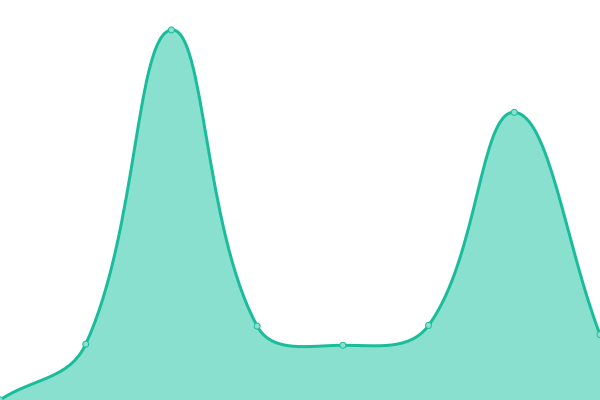

# [📈 Live Status](https://status.liwenduan.com): <!--live status--> **🟩 All systems operational**

This repository contains the open-source uptime monitor and status page for [Liwen Duan](liwenduan.com), powered by [Upptime](https://github.com/upptime/upptime).

With [Upptime](https://upptime.js.org), you can get your own unlimited and free uptime monitor and status page, powered entirely by a GitHub repository. We use [Issues](https://github.com/lwdStudio/lwdStatus/issues) as incident reports, [Actions](https://github.com/lwdStudio/lwdStatus/actions) as uptime monitors, and [Pages](https://status.liwenduan.com) for the status page.

<!--start: status pages-->
<!-- This summary is generated by Upptime (https://github.com/upptime/upptime) -->
<!-- Do not edit this manually, your changes will be overwritten -->
<!-- prettier-ignore -->
| URL | Status | History | Response Time | Uptime |
| --- | ------ | ------- | ------------- | ------ |
|  [Hogwarts Server](https://hogwarts.liwenduan.com/check) | 🟩 Up | [hogwarts-server.yml](https://github.com/lwdStudio/lwdStatus/commits/HEAD/history/hogwarts-server.yml) | 

 2074ms
     
 | 

<a href="https://status.liwenduan.com/history/hogwarts-server">100.00%</a>
    

|  [lwdSite](https://liwenduan.com) | 🟩 Up | [lwd-site.yml](https://github.com/lwdStudio/lwdStatus/commits/HEAD/history/lwd-site.yml) | 

 326ms
     
 | 

<a href="https://status.liwenduan.com/history/lwd-site">100.00%</a>
    

|  [lwdSite API](https://api.liwenduan.com/lwd-site) | 🟩 Up | [lwd-site-api.yml](https://github.com/lwdStudio/lwdStatus/commits/HEAD/history/lwd-site-api.yml) | 

 1044ms
     
 | 

<a href="https://status.liwenduan.com/history/lwd-site-api">99.79%</a>
    

<!--end: status pages-->

[**Visit our status website →**](https://status.liwenduan.com)

## 📄 License

- Powered by: [Upptime](https://github.com/upptime/upptime)
- Code: [MIT](./LICENSE) © [Liwen Duan](liwenduan.com)
- Data in the `./history` directory: [Open Database License](https://opendatacommons.org/licenses/odbl/1-0/)
